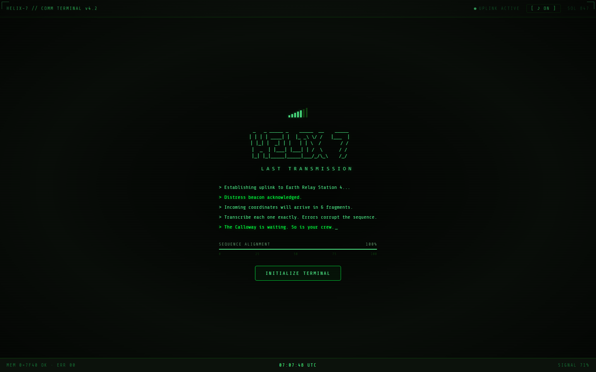
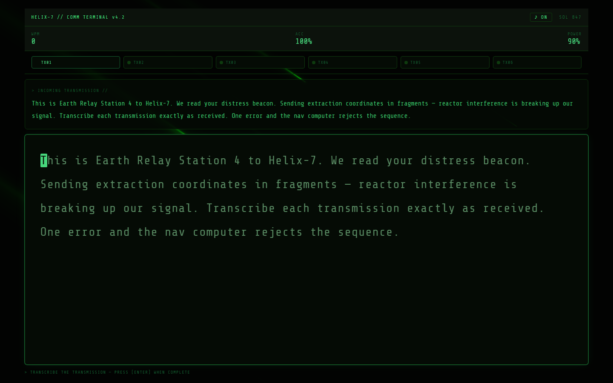
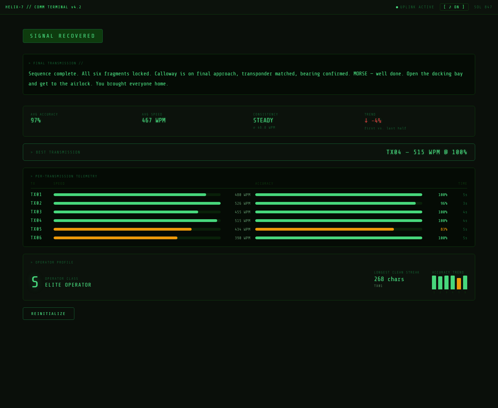

# HELIX-7 // COMM TERMINAL

**A narrative typing game transmitted from deep space.**

Every keystroke rewrites the story. Every mistake costs the crew.

[**Play It →**](https://thirdytapawan.github.io/helix7-demo/)

---

> *"Establishing uplink to Earth Relay Station 4... Distress beacon acknowledged. Incoming coordinates will arrive in 6 fragments. Transcribe each one exactly. Errors corrupt the sequence. The Calloway is waiting. So is your crew."*

You are a comm operator receiving fragmented distress transmissions from a stranded vessel. Transcribe each one accurately to determine the outcome of the mission — and the fate of your crew. Type well, and the crew comes home. Type carelessly, and the signal — and the story — falls apart.

## ✨ Why it's interesting

- **🎮 Typing accuracy *is* the game** — there's no separate "choice" UI. How cleanly you transcribe each transmission silently steers the branching narrative toward one of three endings.
- **🔊 Fully synthesised audio, zero asset files** — the ambient drone pad, sonar pings, and every keystroke SFX are generated live with the Web Audio API. No `.mp3`, no `.wav`, nothing to load.
- **🌌 Hand-rolled WebGL shaders** — the nebula and meteor backgrounds are raw GLSL fragment shaders (no Three.js), including a `tanh()` polyfill for WebGL 1.
- **📡 No `<input>` element** — the entire typing surface is a `keydown`-driven `
`, built to avoid the quirks (autocomplete, IME, mobile keyboard behavior) that come with native text inputs.
- **📊 Real post-run analytics** — consistency (CV of WPM), accuracy trend across the run, best transmission, longest clean streak, and a composite operator grade (S→E) — all derived client-side from the run history.
- **📦 One dependency: React** — everything else (audio, graphics, story engine) is written from scratch.

## 🖥️ Tech Stack

React 18 · Vite 5 · Web Audio API · raw WebGL/GLSL — zero runtime deps beyond React.

## Screens

---

This repo hosts the playable build. Source is maintained in a private repository.
