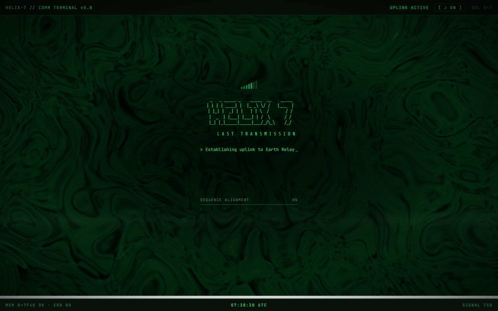
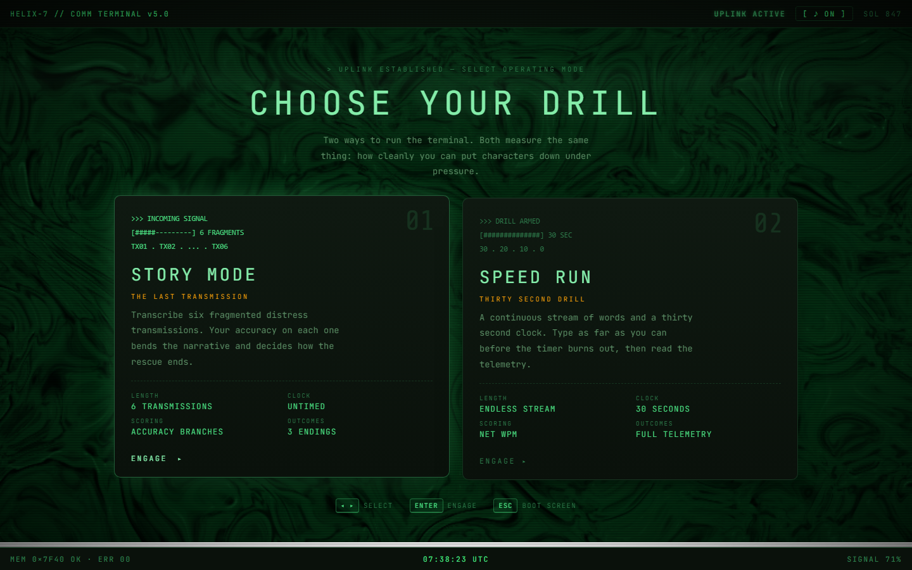
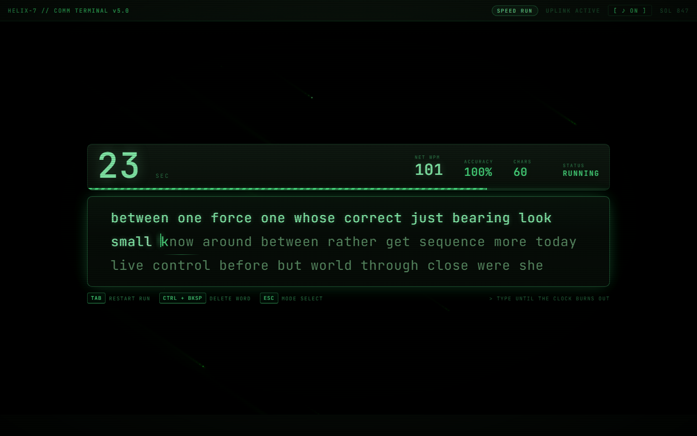
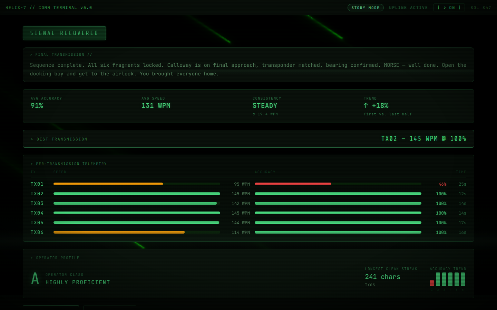
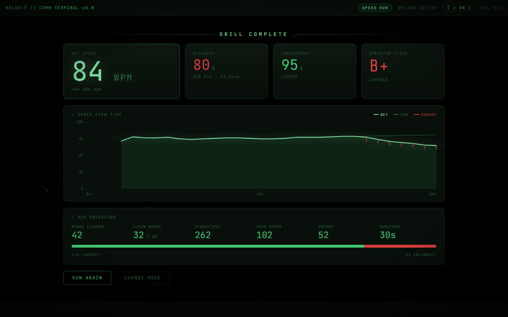

# HELIX-7 // COMM TERMINAL

**A narrative typing game transmitted from deep space, plus a thirty-second drill.**

Every keystroke rewrites the story. Every mistake costs the crew.

[**Play It →**](https://helix-7.vercel.app)

   

---

> **This repo is a showcase.** It covers what HELIX-7 is and how I built it. The source code is kept in a private repository, and the game is hosted at the link above.

> *"Establishing uplink to Earth Relay Station 4... Distress beacon acknowledged. Two operating modes available on this terminal. Transcribe exactly. Errors corrupt the sequence. The Calloway is waiting. So is your crew."*

You're a comm operator receiving fragmented distress transmissions from a stranded ship. Transcribe each one accurately and the crew comes home. Type carelessly and the signal, and the story, falls apart.

## Two modes, one terminal

| Mode | What it is |
|---|---|
| **STORY MODE** | Six distress transmissions. Your accuracy on each one decides which branch the story takes, ending in one of three outcomes: **SIGNAL RECOVERED**, **PARTIAL RECOVERY** or **SIGNAL LOST**. Untimed. |
| **SPEED RUN** | A thirty-second drill against an endless stream of words, followed by a telemetry debrief with net and raw WPM, accuracy, consistency and a speed-over-time graph. |

Both modes share the same typing surface and accuracy engine.

## Screens

## What makes it interesting

- **Typing accuracy *is* the choice.** There is no choice menu. How cleanly you transcribe each transmission silently steers the narrative.
- **Zero audio files.** The ambient drone, the sonar pings and every keystroke click are synthesised live with the Web Audio API. Nothing to download.
- **Hand-written WebGL shaders.** The nebula and meteor backgrounds are raw GLSL, with no 3D library. This includes a polyfill for a math function WebGL 1 doesn't have.
- **No `<input>` element.** The whole typing surface is a keyboard-driven `
`, which avoids autocomplete, IME and mobile-keyboard quirks.
- **Real analytics.** Consistency, accuracy trend, best transmission, longest clean streak and a composite operator grade (S to E), all computed in the browser from the run history. Speed runs add a hand-drawn SVG graph.
- **One dependency: React.** The audio, graphics and story engine are all written from scratch.
- **Keyboard-first.** Arrows and Enter drive the menu, **Tab** restarts, **Esc** backs out and **Ctrl/Alt + Backspace** deletes a whole word, following the rule a real text field uses.

## How I built it

1. **Scaffolded with Vite + React**, with a retro phosphor-green CRT look as the design target: scanlines, vignette, corner brackets and a monospace face.
2. **Wrote the story as data.** The narrative is a flat map of transmissions. Each one has its text, a "good" next step and a "bad" next step, or an ending. Changing the story means editing one data file, not code.
3. **Built the logic as small pure functions** (WPM, accuracy, per-character state, streaks, word-stream generation, consistency, grading). Because they're pure, they could be checked against edge cases such as empty input, overtyping, typographic characters and zero elapsed time.
4. **Made one hook the source of truth.** A single game-state hook owns everything that changes during a run, so the screen components are just rendering. The clock starts on the first keystroke, so WPM reflects typing and not reading time.
5. **Built the components one at a time**, in dependency order: story display, typing surface, stats, transmission tracker, mode picker, then the two debrief screens.
6. **Wrote the graphics and audio from scratch.** The two shaders were developed separately, one for the nebula and one re-themed into green meteors. The audio engine reuses one tiny noise buffer for all keystroke sounds, and one shared filter gives the drone its slow breathing.
7. **Tuned the feel.** The caret is a thin blinking rule between letters, not a block that hides the next character. Text scrolls in a window that follows the caret. The play screen is always exactly one viewport tall, from a 900×540 window up to 4K.
8. **Accessibility pass.** Decorative layers are hidden from screen readers. The mute button announces its state. Reduced-motion users get no shader, typewriter or glitch effects, and the count-up numbers snap to their final values.
9. **Iterated in public.** The branch rule is isolated so it's easy to tune, speed-run stats ignore the first noisy second, and mode navigation, motion lag and the "press any key" flow all got dedicated fix passes. Now live on Vercel.

## Tech stack

React 18 · Vite · Web Audio API · raw WebGL / GLSL · plain CSS · Vercel

## About

Built by **Angelito "Thirdy" Tapawan III**, Computer Engineering student at LPU–Cavite.

[Portfolio](https://thirdytapawan.vercel.app/) · [LinkedIn](https://www.linkedin.com/in/angelito-tapawan-iii/) · [GitHub](https://github.com/ThirdyTapawan)
